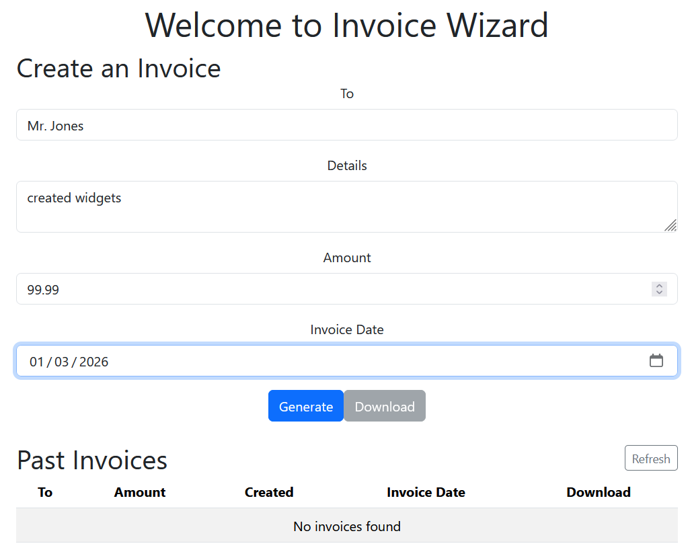
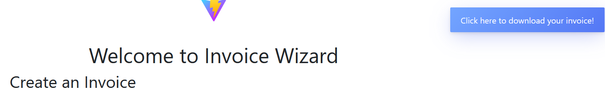
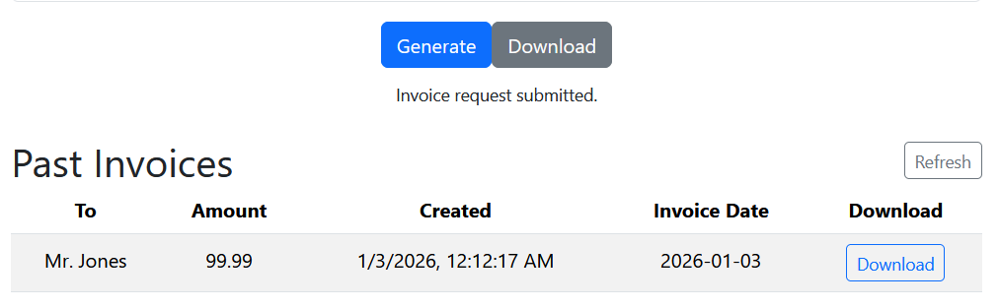
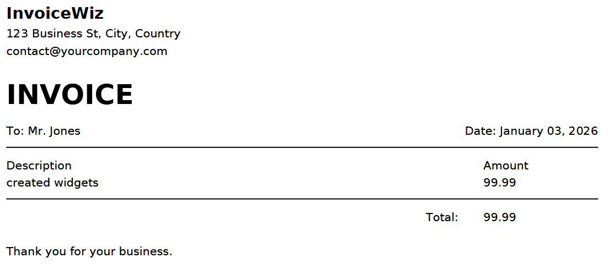
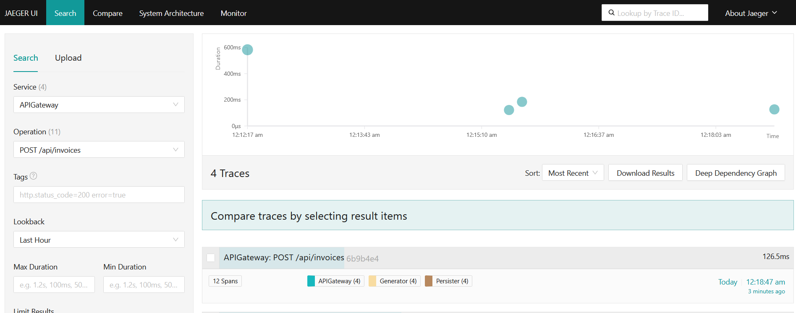
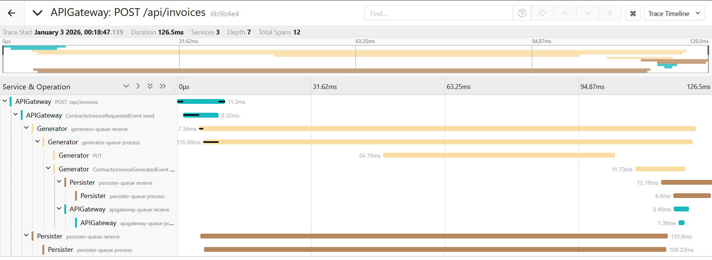
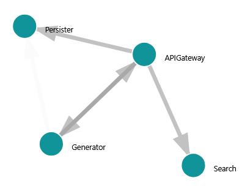
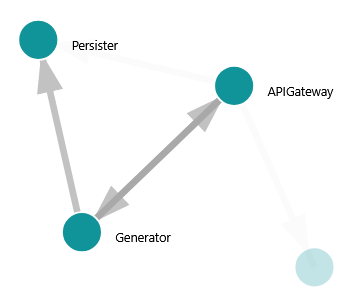
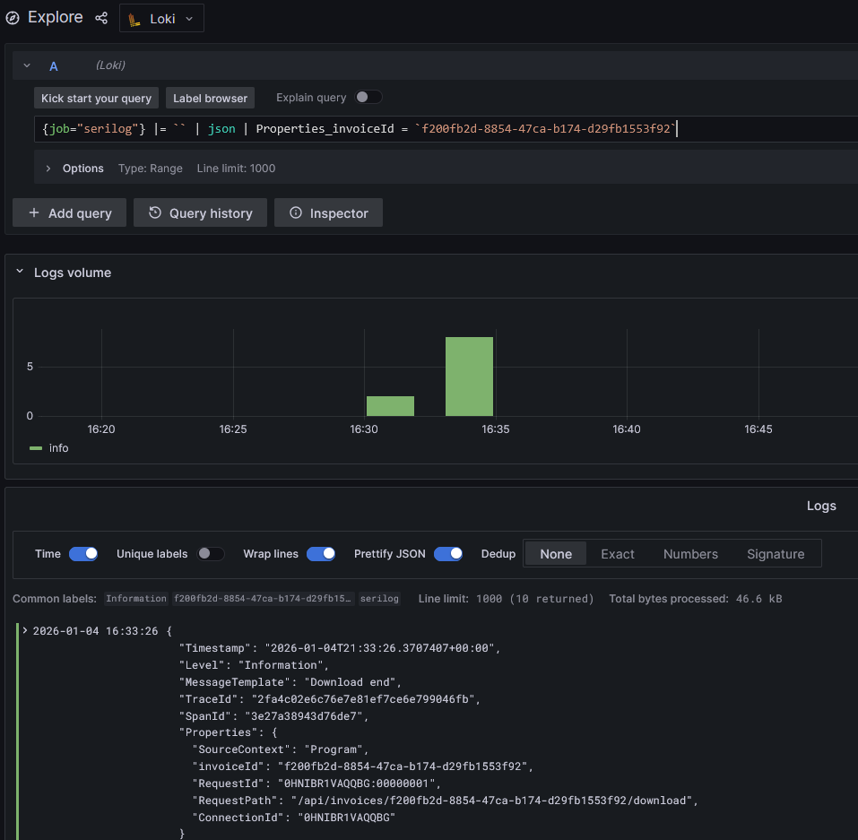
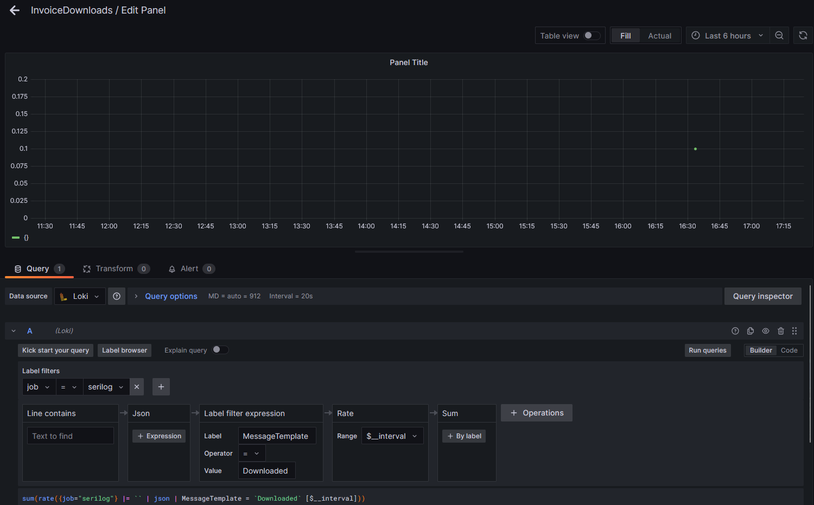

# InvoiceWiz — Demo walkthrough

This demo gives a high-level walkthrough of InvoiceWiz application functionality as well as the observability tools configured on the backend.

**Prerequisites:** Docker Compose running the repo (see `docker-compose.yml`).
Services used: `web`, `apigateway`, `generator`, `persister`, `search`, `jaeger`, and `grafana`.

## 1) Start the stack

Run locally from the repository root:

```bash
docker compose up --build
```

Available Services:
* Web UI: http://localhost:3000
* APIGateway: http://localhost:8080
* Jaeger UI: http://localhost:16686
* Grafana UI: http://localhost:3001

## 2) Create an invoice

Open the Web UI and enter details for the invoice.
Alernatively, see the [APIGateway.http](../APIGateway/APIGateway.http) file to POST an invoice via the back end REST service.



Once generation completes the UI:

1) Displays a download Toast:

2) Enables download via the Download button and the newly added Past Invoices row:


## 3) Inspect the generated invoice PDF

The generated PDF (stored in blob storage / Azurite in local dev) can be viewed:



## 4) Trace the request in Jaeger

Open Jaeger at http://localhost:16686 and search for traces from `apigateway`, `generator`, or `persister` services.
The Jaeger UI overview:



Select a trace to inspect spans across services.
Look for the `InvoiceRequestedEvent` -> `InvoiceGeneratedEvent` flow and spans that show processing times and service calls:



## 5) Architecture reference

Jaeger automatically maps the System Architecture as a force directed graph.
We can see that the APIGateway calls each service either directly (Search via gRPC) or indirectly (Persister and Generator through RabbitMQ):



The Generator has two way communication with APIGateway and pushes to the Persister:


## 6) Log Monitoring

Logs from each service are aggregated and queryable with the Promtail, Loki, Grafana stack thanks to json structued Serilog output.
Search for the logs of a specific invoiceId (the OpenTelemetry trace and span ids are also available):



Create a dashboard showing how many invoices are downloaded (not too exciting yet with our one invoice):



## Final Notes

- Correlated trace IDs across services show the full request lifecycle.
- Spans reveal which service took the most time (useful for performance tuning).
- Events (`InvoiceRequestedEvent`, `InvoiceGeneratedEvent`) appear in the trace timeline and in service logs.
